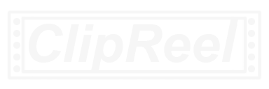
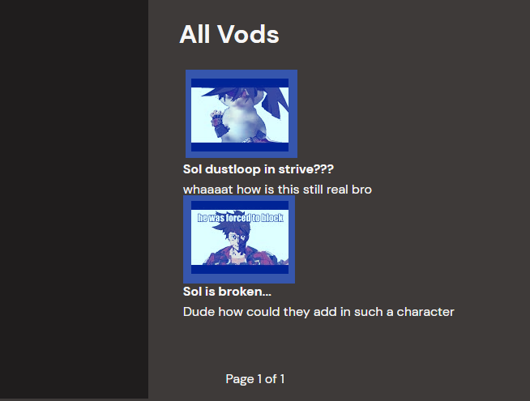
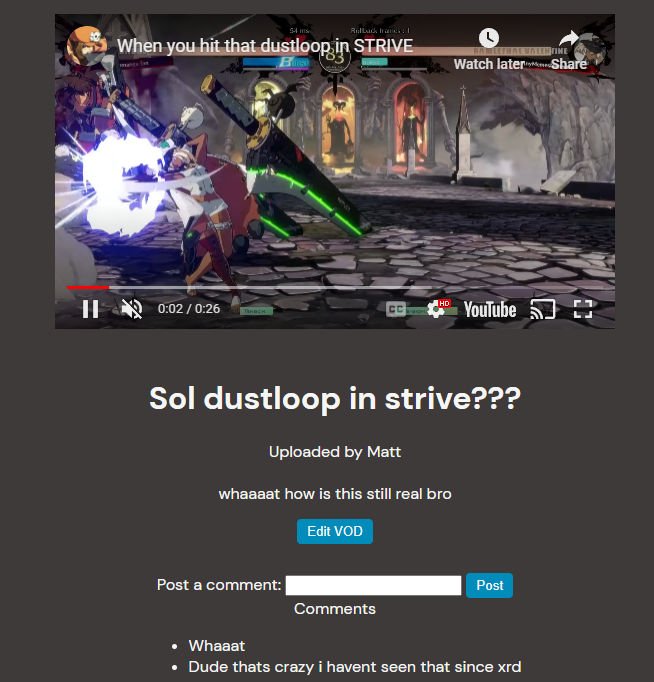

# [Click here to access ClipReel](https://flyio-clipreel.fly.dev/vods)


## Post, Link, and check out the coolest game clips and VODs

<p>ClipReel lets you post your favorite video game snippets using the MEN stack. Upload, Browse, and comment on posts on ClipReel and see new and latest moments from across the web.</p>

## Getting Started

1. Access ClipReel [here](https://google.com/)
2. Log in to ClipReel from the Home page to be able to comment/post.
2. Click on any of the previews to see other's submissions!



## Highlight

<p>ClipReel uses nested entities to handle Comments and has a shallow copy created along with using await in our sequence to "mimic" synchronous code. This highlighted code was essential in understanding async operation sequencing, and learning how it worked is what led to me learning to "break" the rules</p>

```
function newComment(req, res){
  Vod.findById(req.params.vodId)
  .then(async vod => {
    let comment = await Comment.create({
      comment:req.body.comment, 
      owner:req.user.profile._id
    })
    
    vod.comments.push(comment._id)
    vod.save()
    .then(() => {
      console.log("pass for vod save")
      res.redirect(`/vods/${vod._id}`)
    })
    .catch(error => {
      console.log("error for vod save")
      console.log(error)
      res.redirect('/')
    })  
  })
  .catch(error => {
    console.log("error for newComment")
    console.log(error)
    res.redirect('/')
  })
}
```

## Technologies Used

- JavaScript
- HTML
- CSS
- Docker
- EJS
- NodeJS
- MongoDB
- Mongoose
- fly.io
- Adobe Photoshop CS 2023
- Git

## ERD

[Trello Page](https://google.com/)

## IceBox

- AAU or a guest, I should be able to go to a specific category and watch VOD posts by game.
- AAU, I should be able to post replies to other comments on VODs
- AAU or a guest, I should be able to filter VODs by game and or most-least like
- AAU, I should be able to up like VODs posted by myself or other users
- AAU, I should be able to have a page of “liked” vods that I can view
- AAU, All VODs will be embedded youtube videos, with optional snippets for “highlights”

## Attributions
[DM Sans Google Font](https://fonts.google.com/specimen/DM+Sans?query=dm+sans)
[GA SEI Google OAuth template](https://github.com/SEI-Remote/men-stack-oauth-template)
[fly.io App Deployment](https://fly.io/)