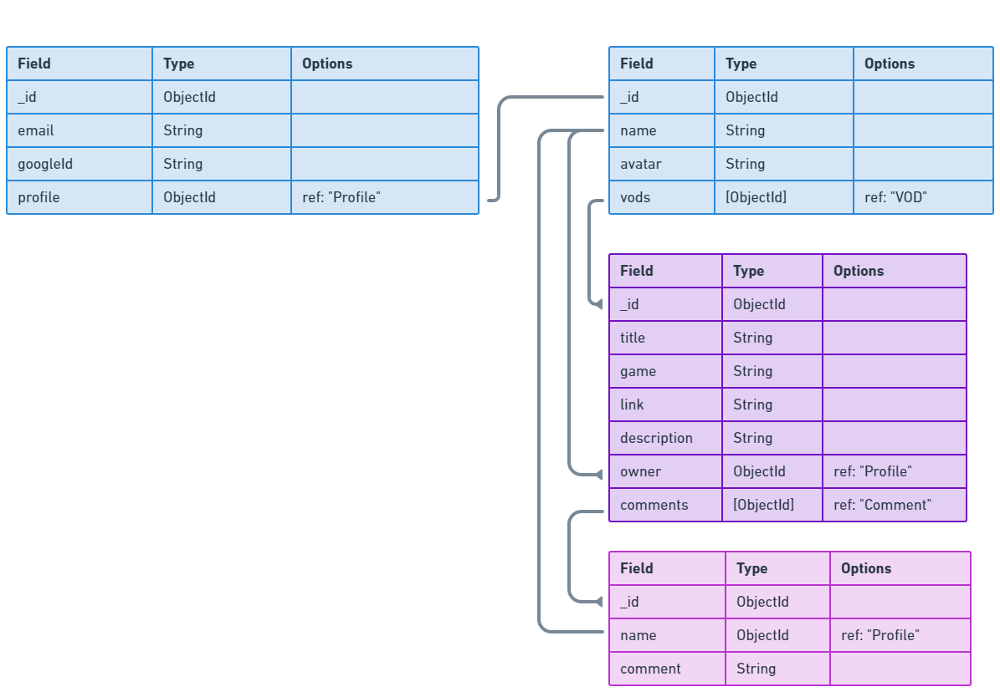

# [Click here to access ClipReel]()

## Post, Link, and check out the coolest game clips and VODs

<p>ClipReel lets you post your favorite video game snippets using the MEN stack. Upload, Browse, and comment on posts on ClipReel and see new and latest moments from across the web.</p>

## Getting Started

<p>
1. Access ClipReel [here](https://google.com/)
</p>

## Highlight

<p>ClipReel uses nested entities to handle Comments, and has a shallow copy created along with using await in our sequence to "mimic" synchronous code. This highlighted code was essential in understanding async operation sequencing, and learning how it worked is what led to me learning to "break" the rules</p>

```
function newComment(req, res){
  Vod.findById(req.params.vodId)
  .then(async vod => {
    let comment = await Comment.create({
      comment:req.body.comment, 
      owner:req.user.profile._id
    })
    
    vod.comments.push(comment._id)
    vod.save()
    .then(() => {
      console.log("pass for vod save")
      res.redirect(`/vods/${vod._id}`)
    })
    .catch(error => {
      console.log("error for vod save")
      console.log(error)
      res.redirect('/')
    })  
  })
  .catch(error => {
    console.log("error for newComment")
    console.log(error)
    res.redirect('/')
  })
}
```

## Technologies Used

- JavaScript
- HTML
- CSS
- Docker
- EJS
- NodeJS
- MongoDB
- Mongoose
- fly.io
- Adobe Photoshop CS 2023
- Git

## ERD

## IceBox

## Known Bugs

## Attributions